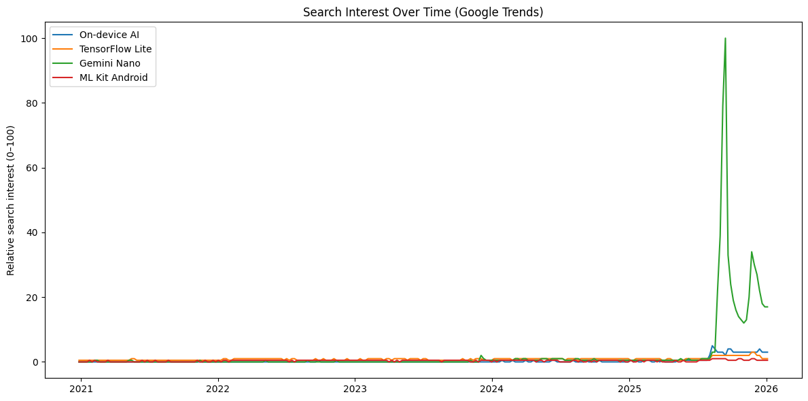
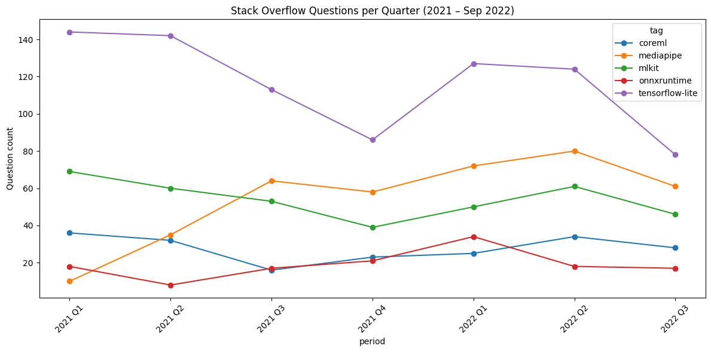
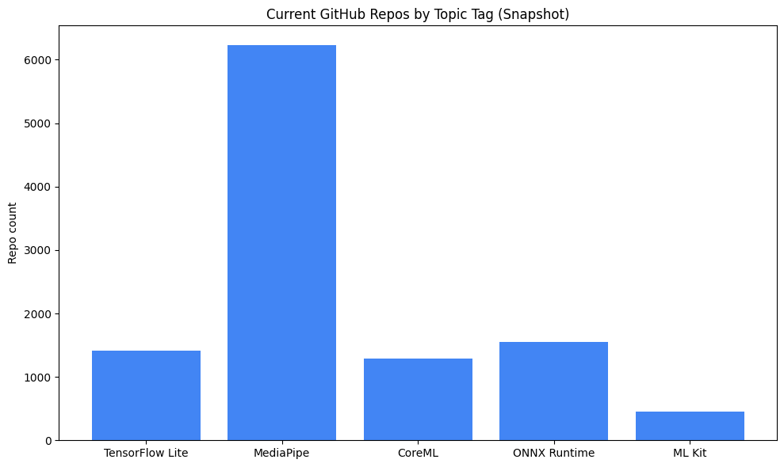

# On-Device AI Adoption: Signal vs. Hype

**Is on-device AI adoption real, or is search hype outpacing actual developer usage?**

This project triangulates three independent public data sources — Google Trends, Stack Overflow, and GitHub — to separate consumer/search-driven hype from genuine developer adoption of on-device AI frameworks: **TensorFlow Lite, MediaPipe, CoreML, ONNX Runtime, and ML Kit**.

---

## Methodology

Three signals, each capturing a different stage of adoption:

| Signal | Source | What it measures | Time range |
|---|---|---|---|
| **Awareness** | Google Trends | Public search interest | 2021 – 2026 |
| **Developer intent** | Stack Overflow (BigQuery public dataset) | Questions asked while implementing | 2021 – Sep 2022 |
| **Shipped code** | GitHub (topic-tagged repo counts) | Current ecosystem size | Present-day snapshot |

The core idea: if a framework only shows up strongly in Trends but not in Stack Overflow or GitHub, that's a sign of hype without follow-through. If it shows up consistently across all three, that's a sign of real, sustained adoption.

---

## Findings

**1. Search interest is dominated by a single recent spike.**
Gemini Nano's launch drove a sharp spike to peak search interest in September 2025, dwarfing everything else on a shared scale. TensorFlow Lite, ML Kit, and the generic phrase "on-device AI" all stayed comparatively flat throughout the 2021–2026 window.



**2. Developer question volume tells a different, more gradual story.**
TensorFlow Lite led every quarter from 2021–2022 but was in decline (144 → 79 questions/quarter). MediaPipe was the clear riser, growing roughly 6x (10 → 61 questions/quarter) over the same period — well before Gemini Nano existed as a product.



**3. Current GitHub activity confirms the MediaPipe trend.**
MediaPipe has by far the largest current topic-tagged repo count (6,227), roughly 4x the next closest framework (ONNX Runtime, 1,555). This is consistent with the upward trajectory already visible in the 2021–2022 Stack Overflow data — two independent signals pointing the same direction.



### Takeaway

> Search hype around on-device AI is concentrated in a single recent event (Gemini Nano), but the underlying developer ecosystem tells a more gradual story. MediaPipe has been quietly outgrowing TensorFlow Lite in both developer questions and shipped repos since 2021 — suggesting real production adoption is happening, just not where the current search spotlight points.

---

## Limitations

This section is deliberately front and center — these caveats materially affect how the findings should be read:

- **Stack Overflow data is a static BigQuery snapshot ending September 25, 2022.** It is not live-synced and captures only early-period developer activity. It cannot speak to the post-2022 period, including the entire Gemini Nano launch window.
- **GitHub numbers are a present-day snapshot, not a historical trend.** GitHub's free search API doesn't support querying repo-creation trends over time, so this signal shows current ecosystem size only, not growth trajectory.
- **ML Kit search and tagging is ambiguous across all three sources.** Google rebranded ML Kit from Firebase ML Kit, resulting in split naming: Stack Overflow uses both `firebase-mlkit` and `google-mlkit` tags (summed here); GitHub topics `mlkit` and `ml-kit` largely overlap rather than representing distinct repo populations, so only `mlkit` (450 repos) is used to avoid double-counting.
- **Gemini Nano search interest may be partly contaminated** by the unrelated "Nano Banana" Gemini image-generation product, which shares the "Gemini Nano/banana" naming space and trended separately around the same period.
- **MediaPipe's GitHub count likely overstates production adoption** relative to the other frameworks, given its popularity in hobbyist, tutorial, and educational projects (webcam demos, pose detection experiments) rather than exclusively production use.
- **Google Trends values below 1 are Google's own rounding artifact** (`<1`), converted to `0.5` here rather than `0` to preserve directional signal rather than erase it.

---

## Reproducing this analysis

**1. Google Trends data**
Manually exported from [trends.google.com/trends/explore](https://trends.google.com/trends/explore) comparing all four search terms together over `1/1/21 – 1/9/26`, worldwide, all categories, web search. See `data/trends_data.csv`.

**2. Stack Overflow data**
Run `queries/stackoverflow_query.sql` in [BigQuery](https://console.cloud.google.com/bigquery) against the public `bigquery-public-data.stackoverflow` dataset (free, no billing account required for public datasets). Export results to `data/stackoverflow_2021_2022.csv`.

**3. GitHub data**
Manual lookups against GitHub's public search API (no auth required for low request volume):
```
https://api.github.com/search/repositories?q=topic:tensorflow-lite
https://api.github.com/search/repositories?q=topic:mediapipe
https://api.github.com/search/repositories?q=topic:coreml
https://api.github.com/search/repositories?q=topic:onnxruntime
https://api.github.com/search/repositories?q=topic:mlkit
```
Record the `total_count` field from each response. See `queries/github_topic_lookups.md` for the full list and results.

**4. Analysis and charts**
Full merge, cleaning, and visualization steps are in `notebooks/analysis.ipynb`, runnable in Google Colab.

---

## Repo structure

```
ondevice-ai-adoption/
├── README.md
├── notebooks/
│   └── analysis.ipynb
├── data/
│   ├── trends_data.csv
│   └── stackoverflow_2021_2022.csv
├── queries/
│   ├── stackoverflow_query.sql
│   └── github_topic_lookups.md
└── charts/
    ├── chart1_trends.png
    ├── chart2_stackoverflow.png
    └── chart3_github.png
```
